# Procesverslag
Markdown is een simpele manier om HTML te schrijven.  
Markdown cheat cheet: [Hulp bij het schrijven van Markdown](https://github.com/adam-p/markdown-here/wiki/Markdown-Cheatsheet).

Nb. De standaardstructuur en de spartaanse opmaak van de README.md zijn helemaal prima. Het gaat om de inhoud van je procesverslag. Besteedt de tijd voor pracht en praal aan je website.

Nb. Door *open* toe te voegen aan een *details* element kun je deze standaard open zetten. Fijn om dat steeds voor de relevante stuk(ken) te doen.

## Jij

  ### Auteur: 
  Tess Esmee Goossens

  #### Je startniveau:
  Rood misschien zwart

  #### Je focus:
  responsive
 

## Je Gekozen website

  ### Je opdracht:
  link naar de website die je gaat namaken óf de naam/omschrijving van je eigen ontwerp
  https://www.lostcauldron.com/ 

  #### Screenshot(s) van de eerste pagina (small screen): 
  Home pagina
  https://www.lostcauldron.com/  
  

  #### Screenshot(s) van de tweede pagina (small screen):
  Matlock shop page
  https://www.lostcauldron.com/matlock-shop  
  
 

## Toegankelijkheidstest 1/2 (week 1)

  ### Bevindingen
  Lijst met je bevindingen die in de test naar voren kwamen: 
  - Skip knop is aanwezig 
  - Shop items worden 2x benoemt een keer bij koppeline en bij de afbeelding 
  - Bij de zwarte banner is de focus niet zichtbaar 
  - Focus afbeelding niet duidelijk zichtbaar 
  - Shop items out of order 
  - Shop items staan niet in een list 
  - De img van matlockshop heeft geen alt 
  - Link openen in nieuwe tab is niet te horen met schreen reader 
  - All media is linked naar socialmedia 
  - Geen dark light mode 
  - Fade in wordt nog steeds weergeven met reduced motion 
  - Knop overlapt tekst 

  ### Data
   
   
   
   
   
   

## Breakdownschets (week 1)

  ### de hele pagina: 
   
  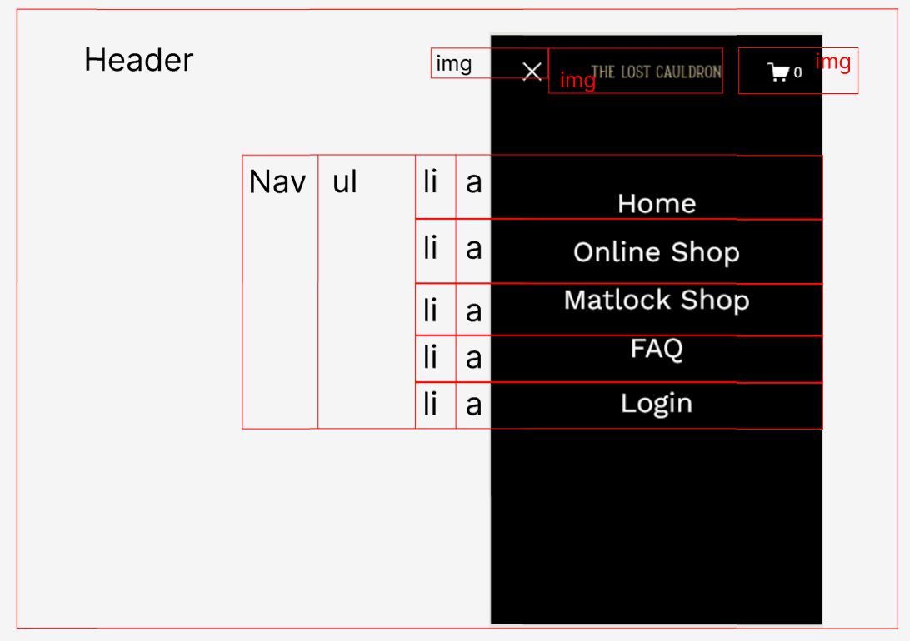 
  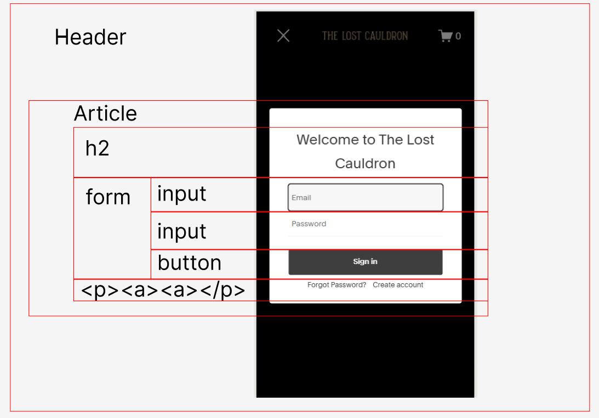 

## Voortgang 1 (week 2)

  
uitwerken voor 1e voortgang

  ### Stand van zaken
  Met het maken van de opdrachten heb ik niet echt veel problemen alleen met de opdrachten van de zwarte pieste heb ik wat meer moeite. Ik heb de opset van het project gemaakt zonder problemen. 
  Als ik nu naar mijn website kijk zie ik 2 onderdelen waar ik meer moeite in moet stoppen om er achter te komen hoe ik dit moet doen (zie de 2 afbeeldingen hieronder) maar ik denk dat ik hier wel uit kom. 

   
   

  ### Agenda voor meeting
  samen met je groepje opstellen

  | Nathan         | Zoë                | Artemis      | Tess             |
  | ---            | ---                | ---          | ---              |
  | Voortgang      | Voortgang          | Voortgang    | Voortgang        |
  | HTML           |                    |              | HTML             |
  |                |                    |              |                  |

  ### Verslag van meeting
  - De site die ik had gekozen was goed maar als ik meer tijd over had kon ik een andere 2e pagina uitkiezen als degene die ik had gekozen vij makkelijk was.
  Aanpassingen van mijn code om semantisch te maken.
  - p weg halen ster in link zelf
  - href in links
  - header toevoegen aan socials
  - p uit shop kan in a staan

## Voortgang 2 (week 3)

  
uitwerken voor 2e voortgang

  ### Stand van zaken
  Ik ben begonnen met het schrijven van de code en heb 3 sections css geschreven en de css opgezet voor de eerste pagina.

  ### Agenda voor meeting
  samen met je groepje opstellen

  | Nathan         | Zoë                | Artemis      | Tess             |
  | ---            | ---                | ---          | ---              |
  | Voortgang      | Voortgang          | Voortgang    | Voortgang        |
  | CSS            | CSS                |              |                  |
  |                |                    |              |                  |

  ### Verslag van meeting
  - 2e pagina is te simpel zoek een wat moeilijkere pagina uit.

## Toegankelijkheidstest 2/2 (week 4)

  
uitwerken na test in 9e werkgroep

  ### Bevindingen
  - Sommige afbeeldingen hebben geen alt.
  - Focus kan duidelijker.
  - Headers kunnen voor screenreaders duidelijker.
  - Geen states.
  - Geen skiplink.
  - Externe links zijn niet duidelijk.
  - Geen darkmode.
  - Svg veranderd niet op high contrast.
  - Geen animaties.
  - sale heeft een lage contrast.

  ### Ga ik nog oplossen
  - Sommige afbeeldingen hebben geen alt. (Fixed)
  - Focus kan duidelijker. (Fixed)
  - Headers kunnen voor screenreaders duidelijker. (Fixed)
  - Geen states. (Fixed)
  - Geen skiplink. (Fixed)
  - Externe links zijn niet duidelijk. (Nu duidelijk voor screenreaders)
  - Geen darkmode. (Fixed)
  - sale heeft een lage contrast. (Fixed)

  ### Aanbevelingen
  - Svg veranderen met high contrast.
  - Meer animaties toevoegen
  - Externe links duidelijker maken

  ### Data
  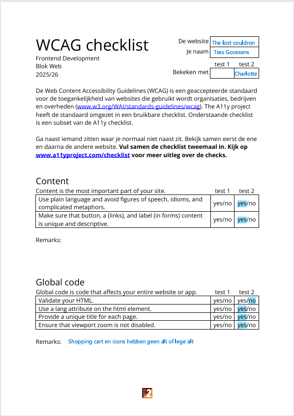 
  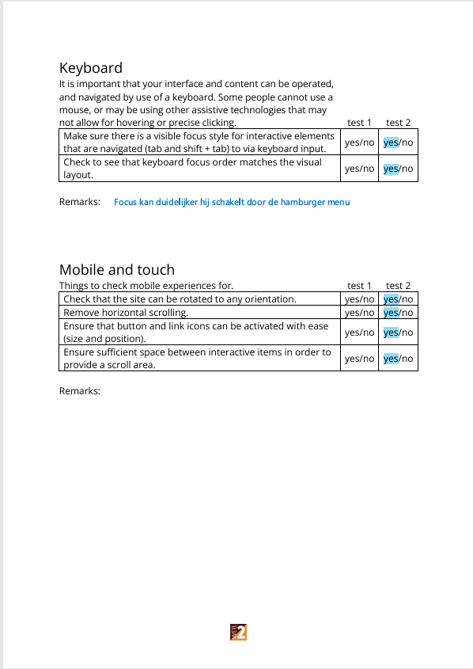 
  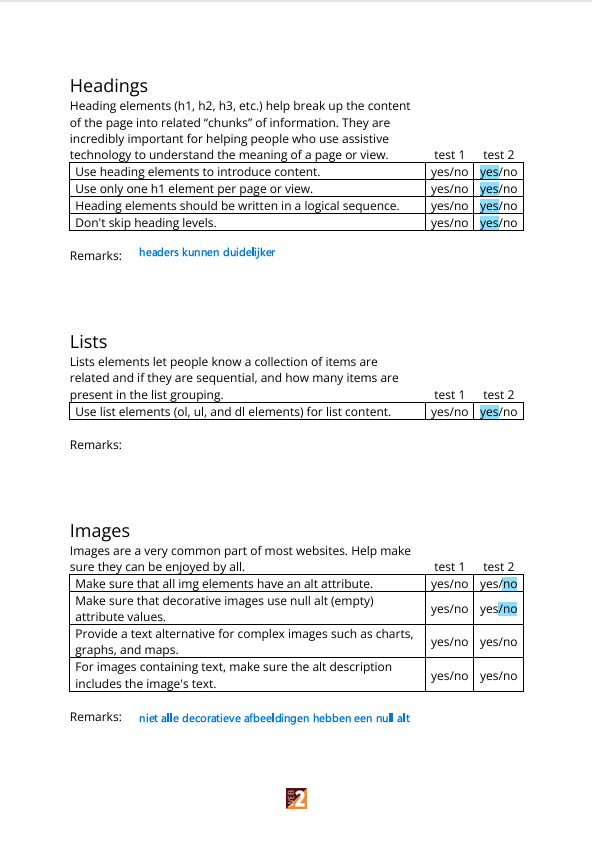 
  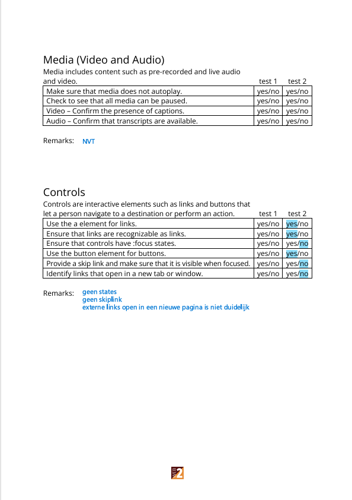 
  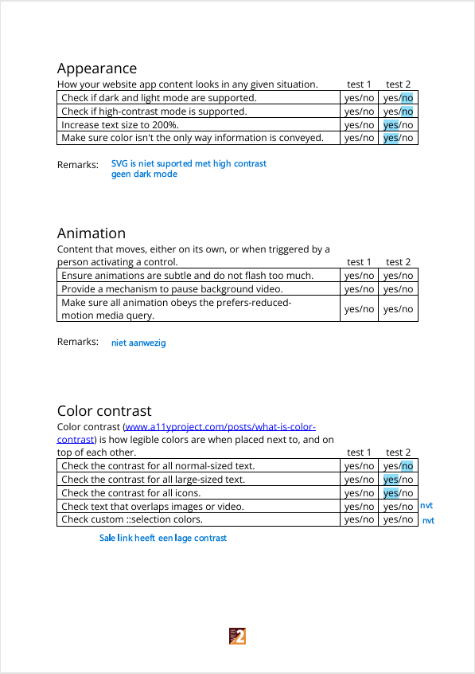 

## Voortgang 3 (week 4)

  
uitwerken voor 3e voortgang

  ### Stand van zaken
  Mijn eerste pagina is bijna af en ben aan het kijken naar mijn 2e pagina

  ### Agenda voor meeting
  samen met je groepje opstellen

  | Nathan         | Zoë                | Artemis      | Tess             |
  | ---            | ---                | ---          | ---              |
  | Voortgang      | Voortgang          | Voortgang    | Voortgang        |
  |                |                    |              |                  |

  ### Verslag van meeting
  Deze meeting ging niet door omdat de docent ziek was en ik had verder geen vragen voor de begeleider. 
   Wel heb ik contact gehouden met mijn groepje en heb Nathan geholpen met wat vragen over het project.

## Eindgesprek (week 5)

  
uitwerken voor eindgesprek

  ### Je uitkomst - karakteristiek screenshots:
  
  
  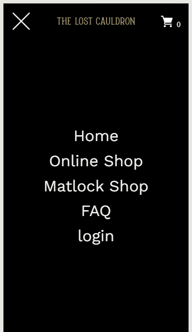

  ### Dit ging goed/Heb ik geleerd: 
  - Grid gebruik en toepassen (Had het niet eerder gedaan)
  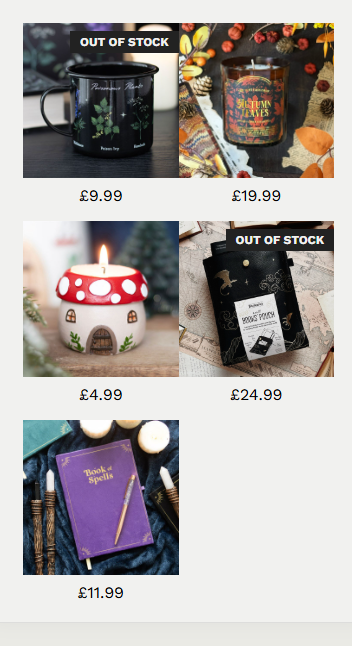

  - Screenreaders and aria (Had het niet eerder gedaan)

  - Het werken met media queries

  - Animaties al had ik meer willen doen als er meer teid voor was (Had het niet eerder gedaan)

  - Google maps op de pagina van shop loccatie (Had het niet eerder gedaan)
  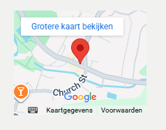

  - Aemantische code schrijven (Had het niet eerder echt gedaan)

  ### Dit was lastig/Is niet gelukt:
   - Animaties al had ik meer willen doen als er meer teid voor was (Had het niet eerder gedaan)

   - Afbeeldingen overlappen (Heb het geprobeerd maar er bleven conflicten komen met stylen als ik het responsive maak)
   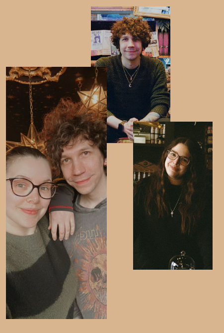

   - Animaties van de follow us Had er geen teid voor en zal hier na de vakantie nog naar kijken want het lijkt me leuk om te weten hoe het werkt
   

   - Customised section overloop
   

  ### Aanbevelingen op basis van WCAG
  - Svg veranderen met high contrast.
  - Meer animaties toevoegen
  - Externe links duidelijker maken

## Bronnenlijst

  
continu bijhouden terwijl je werkt

  Nb. Wees specifiek ('css-tricks' als bron is bijv. niet specifiek genoeg). 
  Nb. ChatGpT en andere AI horen er ook bij.
  Nb. Vermeld de bronnen ook in je code.

  1. CSS tricks guide to flexbox  
     https://css-tricks.com/snippets/css/a-guide-to-flexbox/  

  2. W3Schools CSS 
     https://www.w3schools.com/css/default.asp  

  3. CSS tricks guide to grid  
     https://css-tricks.com/snippets/css/complete-guide-grid/  

  4. Pine tools om de kleur van afbeeldingen te veranderen door middel van colorize en invert colors  
     https://pinetools.com/colorize-image  

  5. MDN om terug te kijken op de pseudo-classes  
     https://developer.mozilla.org/en-US/docs/Web/CSS/Reference/Selectors/Pseudo-classes  

  6. Verschillende oefeningen uit de les  

  7. The lost cauldron voor de content en afbeeldingen van de website  
     https://www.lostcauldron.com/  

  8. W3 Schools Css object-fit  
     https://www.w3schools.com/css/css3_object-fit.asp  

  9. W3 Schools Css Text decoration thickness  
     https://www.w3schools.com/cssref/pr_text_text-decoration-thickness.php  

  10. W3 Schools CSS text-underline-offset Property  
      https://www.w3schools.com/cssref/css3_pr_text-underline-offset.php  

  11. Google fonts voor het vinden van de fonts van mijn site  
      https://fonts.google.com/specimen/Alice?query=alice  

  12. Stack overflow afbeelding square maken met css  
      https://stackoverflow.com/questions/15167545/how-to-crop-a-rectangular-image-into-a-square-with-css  

  13. Aria guide voor accessibility  
      https://developer.mozilla.org/en-US/docs/Web/Accessibility/ARIA/Reference/Attributes  

  14. Css tricks guide to Inclusively Hidden   
      https://css-tricks.com/inclusively-hidden/  

  15. youtube how to add google maps on the website  
      https://www.youtube.com/watch?v=4U_AAGHzTok  

  16. Stackoverflow How to get a blur behind text  
      https://stackoverflow.com/questions/71197714/how-can-i-blur-the-background-behind-text-in-css  

