# Procesverslag
Markdown is een simpele manier om HTML te schrijven.  
Markdown cheat cheet: [Hulp bij het schrijven van Markdown](https://github.com/adam-p/markdown-here/wiki/Markdown-Cheatsheet).

Nb. De standaardstructuur en de spartaanse opmaak van de README.md zijn helemaal prima. Het gaat om de inhoud van je procesverslag. Besteedt de tijd voor pracht en praal aan je website.

Nb. Door *open* toe te voegen aan een *details* element kun je deze standaard open zetten. Fijn om dat steeds voor de relevante stuk(ken) te doen.

## Jij

  ### Auteur: 
  Tess Esmee Goossens

  #### Je startniveau:
  Rood misschien zwart

  #### Je focus:
  Surface plane
 

## Je Gekozen website

  ### Je opdracht:
  link naar de website die je gaat namaken óf de naam/omschrijving van je eigen ontwerp
  https://www.lostcauldron.com/ 

  #### Screenshot(s) van de eerste pagina (small screen): 
  Home pagina
  https://www.lostcauldron.com/  
  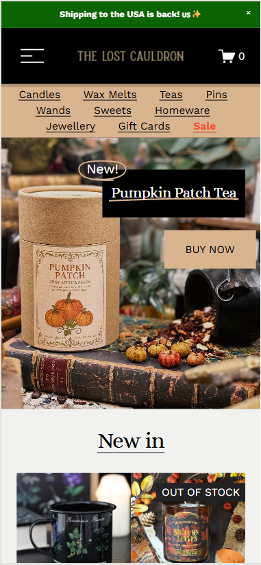

  #### Screenshot(s) van de tweede pagina (small screen):
  Online shop filtert op thee
  https://www.lostcauldron.com/online-shop/teas  
  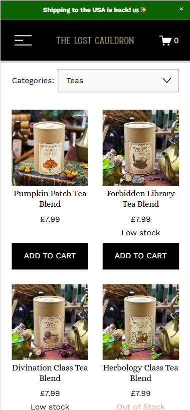
 

## Toegankelijkheidstest 1/2 (week 1)

  ### Bevindingen
  Lijst met je bevindingen die in de test naar voren kwamen: 
  - Skip knop is aanwezig 
  - Shop items worden 2x benoemt een keer bij koppeline en bij de afbeelding 
  - Bij de zwarte banner is de focus niet zichtbaar 
  - Focus afbeelding niet duidelijk zichtbaar 
  - Shop items out of order 
  - Shop items staan niet in een list 
  - De img van matlockshop heeft geen alt 
  - Link openen in nieuwe tab is niet te horen met schreen reader 
  - All media is linked naar socialmedia 
  - Geen dark light mode 
  - Fade in wordt nog steeds weergeven met reduced motion 
  - Knop overlapt tekst 

  ### Data
   
  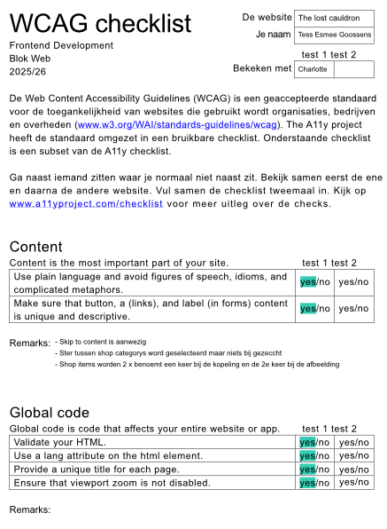 
  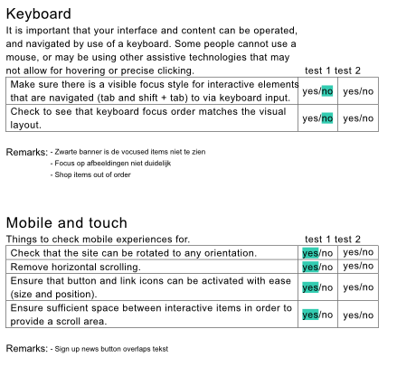 
  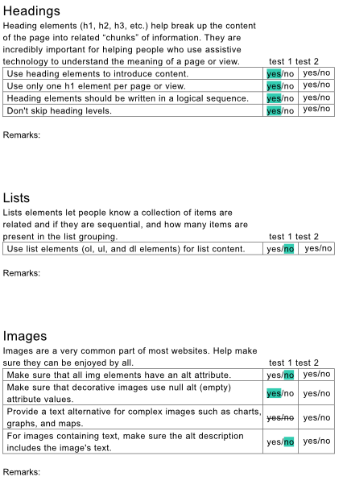 
  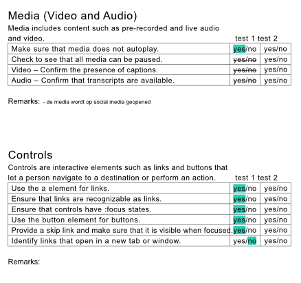 
  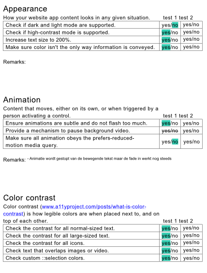 

## Breakdownschets (week 1)

  ### de hele pagina: 
  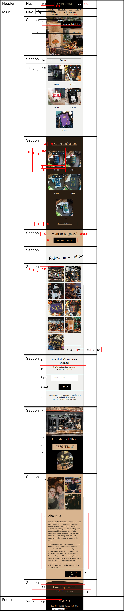 
  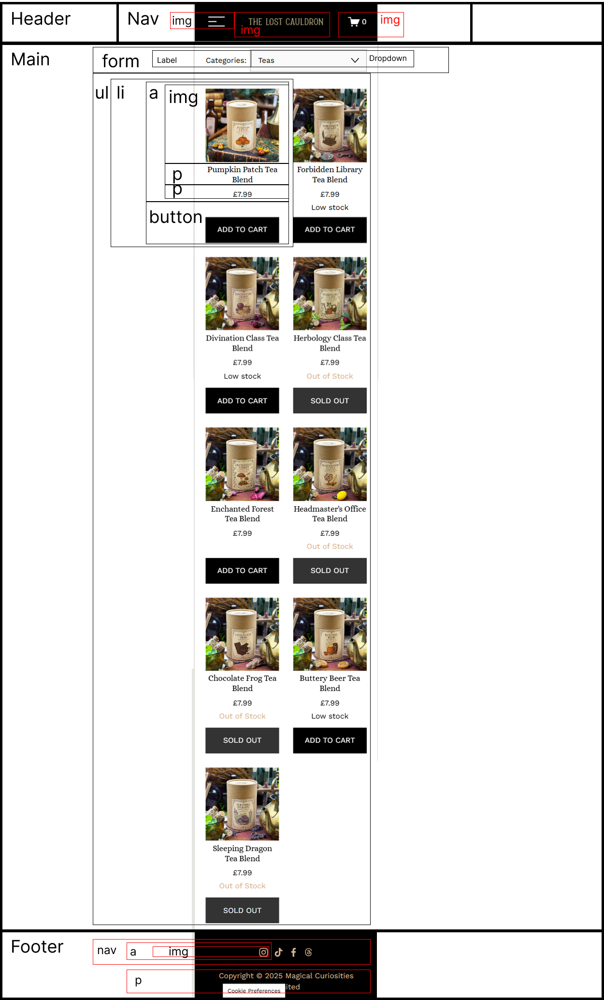 

## Voortgang 1 (week 2)

  
uitwerken voor 1e voortgang

  ### Stand van zaken
  Met het maken van de opdrachten heb ik niet echt veel problemen alleen met de opdrachten van de zwarte pieste heb ik wat meer moeite. Ik heb de opset van het project gemaakt zonder problemen. 
  Als ik nu naar mijn website kijk zie ik 2 onderdelen waar ik meer moeite in moet stoppen om er achter te komen hoe ik dit moet doen (zie de 2 afbeeldingen hieronder) maar ik denk dat ik hier wel uit kom. 

  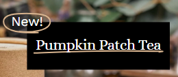 
  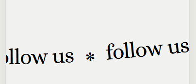 

  ### Agenda voor meeting
  samen met je groepje opstellen

  | Nathan         | Zoë                | Artemis      | Tess             |
  | ---            | ---                | ---          | ---              |
  | Voortgang      | Voortgang          | Voortgang    | Voortgang        |
  | HTML           |                    |              | HTML             |
  |                |                    |              |                  |

  ### Verslag van meeting
  hier na afloop snel de uitkomsten van de meeting vastleggen

  - punt 1
  - punt 2
  - nog een punt
  - ...

## Voortgang 2 (week 3)

  
uitwerken voor 2e voortgang

  ### Stand van zaken
  hier dit ging goed & dit was lastig (neem ook screenshots op van delen van je website en code)

  ### Agenda voor meeting
  samen met je groepje opstellen

  | student 1      | student 2          | student 3    | student 4        |
  | ---            | ---                | ---          | ---              |
  | dit bespreken  | en dit             | en ik dit    | en dan ik dat    |
  | en dat ook nog | dit als er tijd is | nog een punt | dit wil ik zeker |
  | ...            | ...                | ...          | ...              |

  ### Verslag van meeting
  hier na afloop snel de uitkomsten van de meeting vastleggen

  - punt 1
  - punt 2
  - nog een punt
- ...

## Toegankelijkheidstest 2/2 (week 4)

  
uitwerken na test in 9e werkgroep

  ### Bevindingen
  Lijst met je bevindingen die in de test naar voren kwamen (geef ook aan wat er verbeterd is):

## Voortgang 3 (week 4)

  
uitwerken voor 3e voortgang

  ### Stand van zaken
  hier dit ging goed & dit was lastig (neem ook screenshots op van delen van je website en code)

  ### Agenda voor meeting
  samen met je groepje opstellen

  | student 1      | student 2          | student 3    | student 4        |
  | ---            | ---                | ---          | ---              |
  | dit bespreken  | en dit             | en ik dit    | en dan ik dat    |
  | en dat ook nog | dit als er tijd is | nog een punt | dit wil ik zeker |
  | ...            | ...                | ...          | ...              |

  ### Verslag van meeting
  hier na afloop snel de uitkomsten van de meeting vastleggen

  - punt 1
  - punt 2
  - nog een punt
  - ...

## Eindgesprek (week 5)

  
uitwerken voor eindgesprek

  ### Je uitkomst - karakteristiek screenshots:
  

  ### Dit ging goed/Heb ik geleerd: 
  Korte omschrijving met plaatjes

  

  ### Dit was lastig/Is niet gelukt:
  Korte omschrijving met plaatjes

  

## Bronnenlijst

  
continu bijhouden terwijl je werkt

  Nb. Wees specifiek ('css-tricks' als bron is bijv. niet specifiek genoeg). 
  Nb. ChatGpT en andere AI horen er ook bij.
  Nb. Vermeld de bronnen ook in je code.

  1. bron 1
  2. bron 2
  3. ...

